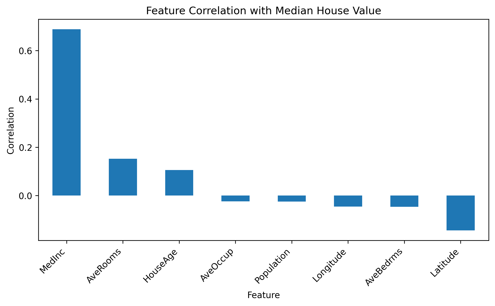

# California Housing Regression Analysis

This project performs regression analysis on the California Housing dataset using Python and scikit-learn.

The goal is to predict median house values for California districts using demographic, household, and geographic features.

This project compares 9 regression models:

1. Linear Regression
2. Polynomial Regression
3. Ridge Regression
4. Lasso Regression
5. ElasticNet Regression
6. Decision Tree Regression
7. Random Forest Regression
8. Gradient Boosting Regression
9. HistGradientBoosting Regression

The best-performing model in this project is HistGradientBoosting Regression, which achieved the highest test R² and the lowest test RMSE.

## Dataset

This project uses the California Housing dataset from scikit-learn.

Dataset documentation: https://scikit-learn.org/stable/datasets/real_world.html#california-housing-dataset

The dataset contains housing information for California districts.

## Features

| Feature | Description |
|---|---|
| MedInc | Median income in block group |
| HouseAge | Median house age in block group |
| AveRooms | Average number of rooms per household |
| AveBedrms | Average number of bedrooms per household |
| Population | Block group population |
| AveOccup | Average number of household members |
| Latitude | Block group latitude |
| Longitude | Block group longitude |

## Target

The target variable is the median house value for California districts.

The target is expressed in units of $100,000. For example, a target value of 2.0 represents approximately $200,000.

## Project Structure

    California-housing/
    |-- notebooks/
    |-- src/
    |-- results/
    |-- figures/
    |-- .gitignore
    |-- README.md
    |-- requirements.txt
    |-- LICENSE

## Feature-Target Correlation

A feature-target correlation analysis was performed to measure the relationship between each feature and the target variable.

### Correlation Findings

`MedInc` has the strongest positive correlation with median house value. This suggests that districts with higher median income tend to have higher median house values.

`Latitude` has the strongest negative correlation among the features, suggesting that location is related to housing prices.

## Models

### Linear Regression

Linear Regression is used as the baseline model.

### Polynomial Regression

Polynomial Regression creates polynomial (of degree 2).

In this project, Polynomial Regression performed better than the basic linear models, suggesting that nonlinear relationships are important.

### Ridge Regression

Ridge Regression is a linear regression model with L2 regularization.

### Lasso Regression

Lasso Regression is a linear regression model with L1 regularization.

### ElasticNet Regression

ElasticNet Regression combines L1 and L2 regularization.

### Decision Tree Regression

Decision Tree Regression makes predictions using a tree structure of decision rules.

### Random Forest Regression

Random Forest Regression combines many decision trees and averages their predictions.

### Gradient Boosting Regression

Gradient Boosting Regression builds trees sequentially.

### HistGradientBoosting Regression

HistGradientBoosting Regression is a histogram-based version of gradient boosting.

In this project, HistGradientBoosting Regression achieved the best test performance.

## Evaluation Metrics

The models are evaluated using the following metrics:

| Metric | Meaning |
|---|---|
| R² | Proportion of variance explained by the model |
| MAE | Mean Absolute Error |
| MSE | Mean Squared Error |
| RMSE | Root Mean Squared Error |

RMSE is especially useful because it is in the same unit as the target variable. Since the California Housing target is measured in units of $100,000, an RMSE of 0.4535 means the typical prediction error is about $45,350.

## Results

### Full Model Results

| Model | Data | R² | MAE | MSE | RMSE |
|---|---|---:|---:|---:|---:|
| Linear Regression | Train | 0.6126 | 0.5286 | 0.5179 | 0.7197 |
| Linear Regression | Test | 0.5758 | 0.5332 | 0.5559 | 0.7456 |
| Polynomial Regression | Train | 0.6853 | 0.4608 | 0.4207 | 0.6486 |
| Polynomial Regression | Test | 0.6457 | 0.4670 | 0.4643 | 0.6814 |
| Ridge Regression | Train | 0.6126 | 0.5286 | 0.5179 | 0.7197 |
| Ridge Regression | Test | 0.5758 | 0.5332 | 0.5559 | 0.7456 |
| Lasso Regression | Train | 0.6125 | 0.5287 | 0.5180 | 0.7197 |
| Lasso Regression | Test | 0.5769 | 0.5331 | 0.5545 | 0.7446 |
| ElasticNet Regression | Train | 0.6125 | 0.5287 | 0.5180 | 0.7197 |
| ElasticNet Regression | Test | 0.5768 | 0.5331 | 0.5546 | 0.7447 |
| Decision Tree Regression | Train | 0.7445 | 0.4080 | 0.3415 | 0.5844 |
| Decision Tree Regression | Test | 0.6821 | 0.4456 | 0.4166 | 0.6454 |
| Random Forest Regression | Train | 0.9124 | 0.2152 | 0.1171 | 0.3423 |
| Random Forest Regression | Test | 0.7995 | 0.3318 | 0.2627 | 0.5126 |
| Gradient Boosting Regression | Train | 0.8253 | 0.3371 | 0.2336 | 0.4833 |
| Gradient Boosting Regression | Test | 0.7925 | 0.3550 | 0.2720 | 0.5215 |
| HistGradientBoosting Regression | Train | 0.8974 | 0.2539 | 0.1372 | 0.3704 |
| HistGradientBoosting Regression | Test | 0.8431 | 0.3012 | 0.2056 | 0.4535 |

## Key Findings

HistGradientBoosting Regression achieved the best performance on the test set.

It reached a test R² of 0.8431 and a test RMSE of 0.4535.

This means the model explains about 84.31% of the variance in the test data, and its typical prediction error is about $45,350.

Tree-based ensemble models performed better than linear models. 

This suggests that California housing prices are influenced by nonlinear relationships and feature interactions.

Polynomial Regression also improved over basic linear regression, which further supports the idea that the relationship between housing features and median house value is not purely linear.

Ridge, Lasso, and ElasticNet performed similarly to Linear Regression. This suggests that regularization alone did not significantly improve prediction performance when using only the original features.

## Prediction Plots

The project generates true vs. predicted plots for each model.

For example, 

The red dashed line represents perfect prediction. Points closer to the line indicate better predictions.

## How to Run

This project was developed in Google Colab. Run notebooks in order:

    Setup.ipynb
    Regression Analysis on California Housing Data.ipynb

## Author

Yi-Heng Tsai
